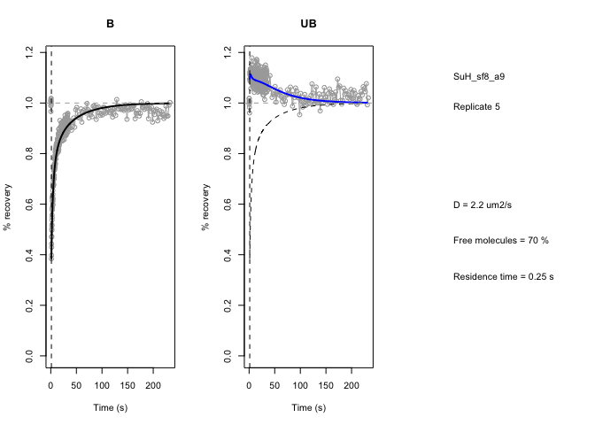
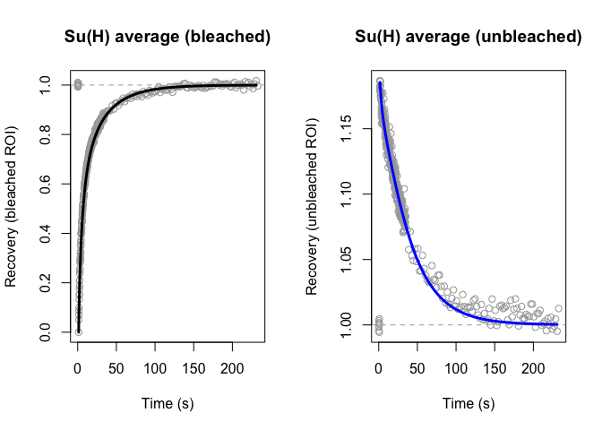

Su(H) FRAP analysis
===================

This repository contains the code for the FRAP analysis in Gomez-Lamarca
et al (2018) paper.

The FRAP analysis pipeline
--------------------------

Re-running the analysis for all datasets takes a couple of weeks of CPU
time, so we will here illustrate the approach on a single Su(H)
replicate. You should be able to run this on your machine in a couple of
minutes.

### Dependencies

Dependencies can be found in the [R/frapr-pkg.R](R/frapr-pkg.R) file. An
additional unpublished package `must` is required and can be found in
[dependencies/must-1.0.tar.gz](dependencies/must-1.0.tar.gz).

### Pipeline

The FRAP analysis is implemented in the `frapr` package which is sourced
using `devtools`. Backend functions are abstracted by the
`fittingTasks.R` file.

    suppressPackageStartupMessages(source("fittingTasks.R"))

    ## Loading frapr

    ## Warning: package 'RcppArmadillo' was built under R version 3.4.3

    ## Warning: package 'spatstat' was built under R version 3.4.3

    ## Warning: package 'spatstat.data' was built under R version 3.4.3

    ## Warning in strptime(x, "%Y-%m-%d-%H-%M-%OS", tz = tz): unknown timezone 'zone/tz/2017c.1.0/zoneinfo/Europe/London'

We will select the Su(H) wildtype dataset, replicate 5. The individual
frames for this replicate are provided in the `images/` directory.

    fun = fittingBase$SuH_sf8_a9_20170810

    out = fun$fit(5, list(Free.range=0.70, D.range=2.2e-12, 
                          res.time.range=0.25,
                          roi.file="rois.zip", roi.fg=c("B", "UB"), 
                          first.ROI.only=FALSE,
                          save.base=NA, algorithm="full"))

    ## Using scaling factor:  10 
    ## Processing with residence time 1 / 1 
    ## => Processing with Free range 1 / 1 
    ## => Processing with D range 1 / 1 
    ## Using OLD initRates()
    ## Performing the Free rate correction
    ## Performing bleach depth correction
    ## Starting simulation
    ## Simulation finished in  2.051 0.294 2.346 0 0

The fitting function takes a range of values to simulated, creating an
grid array of all combinations. In the example above we used a single
value for the proportion of free molecules (`Free.range`), diffussion
(`D.range`) and residence time (`res.time.range`). We track recovery in
two regions of interest (ROIs): `B` and `UB`. The `B` region is where
the bleaching took place, and `UB` is a distant region within the
nucleus that is not directly bleached. These ROIs were drawn using
ImageJ and stored in `rois.zip`. Finally, we will use the "full"
algorithm that does the full dynamical model with binding and diffusion,
using the approach by [Beaudouin et al
2006](https://www.ncbi.nlm.nih.gov/pubmed/16387760).

The output object `out` contains the error rate, as well the full
simulation trace along the grid of values. As we used only a single
combination of parameters, we can extract and plot the resulting object
as follows:

    sim = out$e$sim[[1]][[1]][[1]]
    p = sim$params
    plotParamCurves(out$img, p, out$e$res.time, out$e$Free, out$e$D, "SuH_sf8_a9", 5, mfrow=c(1,3),
                    sim.mean=sim)

The first panel shows the recovery in the bleached region, the second in
the unbleached (distant) region, and the final panel shows the
parameters used in the simulation. We see a good correspondance between
the curves that are observed (in gray) and the predicted recovery (in
black and blue).

The final heatmaps shown in the paper have been obtained by averaging
the error matrices `out$e$err` for all the replicates.

    out$e$err

    ## , , 2.2e-12
    ## 
    ##               0.7
    ## 0.25 0.0007069079

Total errors for different replicates
-------------------------------------

We saved the output of running the above algorithm on all datasets into
a `.RData` file provided in this repository:

    load("../data/fittingData.RData")

First we'll verify that the error rate calculate in the previous section
(variable `out`) for replicate 5 with 0.25s residence time, 70% free,
2.2e-12 um2/s diffusion matches that in the raw data file (variable
`sets.all.err`). Note that because all the datasets for this experiment
with different are collected into a single array the data for this
replicate can be found at the index of 15.

    assert_that(are_equal(out$e$err[1,1,1], sets.all.err$SuH_sf8_a9[[15]]["0.25", "0.7", "2.2e-12"]))

    ## [1] TRUE

Next we'll print the raw data as shown on the heatmap on Figure 1 (which
is an average over `sets.all.err$SuH_sf8_a9` for all replicates). Here
the rows are different residence times (in seconds), and columns are
percentage of free molecules. The error is the mean square error of the
difference between the predicted and observed recovery.

    round(log10(sets$SuH_sf8_a9),2)

    ##       0.05   0.1  0.15   0.2  0.25   0.3  0.35   0.4  0.45   0.5  0.55   0.6  0.65   0.7  0.75   0.8  0.85   0.9  0.95
    ## 0.1  -1.24 -1.46 -1.63 -1.78 -1.91 -2.02 -2.13 -2.23 -2.31 -2.38 -2.44 -2.48 -2.49 -2.49 -2.45 -2.40 -2.33 -2.25 -2.16
    ## 0.25 -1.24 -1.46 -1.63 -1.77 -1.90 -2.02 -2.13 -2.22 -2.31 -2.38 -2.44 -2.48 -2.49 -2.49 -2.45 -2.40 -2.33 -2.25 -2.16
    ## 0.5  -1.24 -1.46 -1.62 -1.77 -1.90 -2.01 -2.12 -2.21 -2.30 -2.37 -2.43 -2.48 -2.50 -2.49 -2.46 -2.40 -2.33 -2.25 -2.16
    ## 0.75 -1.24 -1.45 -1.62 -1.76 -1.89 -2.01 -2.11 -2.21 -2.29 -2.37 -2.43 -2.47 -2.50 -2.49 -2.46 -2.41 -2.34 -2.26 -2.16
    ## 1    -1.24 -1.45 -1.62 -1.76 -1.88 -2.00 -2.10 -2.20 -2.28 -2.36 -2.42 -2.47 -2.49 -2.49 -2.47 -2.41 -2.35 -2.26 -2.17
    ## 2    -1.23 -1.44 -1.60 -1.74 -1.86 -1.97 -2.07 -2.17 -2.25 -2.33 -2.40 -2.45 -2.49 -2.50 -2.48 -2.43 -2.36 -2.28 -2.18
    ## 4    -1.23 -1.42 -1.57 -1.70 -1.81 -1.91 -2.01 -2.10 -2.19 -2.27 -2.35 -2.41 -2.46 -2.49 -2.49 -2.46 -2.40 -2.31 -2.19
    ## 6    -1.22 -1.40 -1.54 -1.66 -1.77 -1.86 -1.96 -2.04 -2.13 -2.21 -2.29 -2.36 -2.43 -2.47 -2.49 -2.47 -2.42 -2.33 -2.21
    ## 8    -1.21 -1.39 -1.52 -1.63 -1.73 -1.82 -1.91 -1.99 -2.08 -2.16 -2.24 -2.32 -2.39 -2.45 -2.48 -2.48 -2.44 -2.35 -2.22
    ## 10   -1.20 -1.37 -1.50 -1.60 -1.70 -1.78 -1.87 -1.95 -2.03 -2.11 -2.19 -2.27 -2.35 -2.42 -2.46 -2.48 -2.45 -2.36 -2.23
    ## 15   -1.19 -1.34 -1.45 -1.54 -1.63 -1.71 -1.78 -1.86 -1.93 -2.01 -2.09 -2.17 -2.26 -2.34 -2.41 -2.46 -2.45 -2.38 -2.25
    ## 20   -1.18 -1.31 -1.41 -1.50 -1.58 -1.65 -1.72 -1.79 -1.86 -1.94 -2.01 -2.10 -2.18 -2.27 -2.36 -2.42 -2.45 -2.40 -2.26
    ## 25   -1.16 -1.29 -1.38 -1.46 -1.53 -1.60 -1.67 -1.74 -1.81 -1.88 -1.96 -2.04 -2.13 -2.22 -2.31 -2.39 -2.43 -2.40 -2.27
    ## 30   -1.15 -1.27 -1.36 -1.43 -1.50 -1.57 -1.63 -1.70 -1.76 -1.83 -1.91 -1.99 -2.08 -2.17 -2.27 -2.36 -2.42 -2.40 -2.28
    ## 40   -1.14 -1.24 -1.32 -1.39 -1.45 -1.51 -1.57 -1.64 -1.70 -1.77 -1.84 -1.92 -2.01 -2.11 -2.21 -2.31 -2.39 -2.40 -2.29
    ## 50   -1.12 -1.22 -1.29 -1.35 -1.41 -1.47 -1.53 -1.59 -1.66 -1.72 -1.79 -1.87 -1.96 -2.06 -2.17 -2.28 -2.37 -2.40 -2.29
    ## 60   -1.11 -1.20 -1.27 -1.33 -1.38 -1.44 -1.50 -1.56 -1.62 -1.69 -1.76 -1.84 -1.92 -2.02 -2.13 -2.25 -2.35 -2.39 -2.29
    ## 70   -1.10 -1.18 -1.25 -1.30 -1.36 -1.42 -1.47 -1.53 -1.59 -1.66 -1.73 -1.81 -1.90 -1.99 -2.10 -2.22 -2.33 -2.38 -2.30
    ## 80   -1.09 -1.17 -1.23 -1.29 -1.34 -1.39 -1.45 -1.51 -1.57 -1.64 -1.71 -1.78 -1.87 -1.97 -2.08 -2.20 -2.32 -2.38 -2.30
    ## 100  -1.07 -1.14 -1.20 -1.26 -1.31 -1.36 -1.42 -1.47 -1.53 -1.60 -1.67 -1.75 -1.83 -1.93 -2.04 -2.17 -2.29 -2.37 -2.30
    ## 120  -1.06 -1.13 -1.18 -1.23 -1.28 -1.34 -1.39 -1.45 -1.51 -1.57 -1.64 -1.72 -1.80 -1.90 -2.01 -2.14 -2.27 -2.36 -2.30
    ## 140  -1.04 -1.11 -1.16 -1.21 -1.26 -1.32 -1.37 -1.43 -1.48 -1.55 -1.62 -1.69 -1.78 -1.88 -1.99 -2.12 -2.25 -2.35 -2.30
    ## 160  -1.04 -1.10 -1.15 -1.20 -1.25 -1.30 -1.35 -1.41 -1.47 -1.53 -1.60 -1.67 -1.76 -1.86 -1.97 -2.10 -2.23 -2.34 -2.30
    ## 180  -1.03 -1.09 -1.14 -1.19 -1.23 -1.28 -1.34 -1.39 -1.45 -1.51 -1.58 -1.66 -1.74 -1.84 -1.95 -2.08 -2.22 -2.33 -2.30
    ## 200  -1.02 -1.08 -1.13 -1.17 -1.22 -1.27 -1.32 -1.38 -1.44 -1.50 -1.57 -1.64 -1.73 -1.83 -1.94 -2.07 -2.21 -2.32 -2.30

We can also plot the average recovery (gray circles) versus the
prediction from the best combination of parameters (black and blue
lines):

    t = sets.t$SuH_sf8_a9
    curve = sets.curve$SuH_sf8_a9
    predicted = best.predicted$SuH_sf8_a9

    par(mfrow=c(1,2))
    plot(t, curve[,1], main="Su(H) average (bleached)", col="darkgray", xlab="Time (s)", ylab="Recovery (bleached ROI)")
    abline(h=1, lty=2, col="darkgray")
    lines(t[-c(1:10, length(t))], predicted[,1], lwd=3, col="black")

    plot(t, curve[,2], main="Su(H) average (unbleached)", col="darkgray", xlab="Time (s)", ylab="Recovery (unbleached ROI)")
    abline(h=1, lty=2, col="darkgray")
    lines(t[-c(1:10, length(t))], predicted[,2], lwd=3, col="blue")

The data for the remaining datasets are also available in the
[data/FRAP\_fitting\_data.RData](data/FRAP_fitting_data.RData) file.

    names(sets)

    ## [1] "SuH_locus_control" "SuH_locus_notch"   "SuH_mamdn"         "SuH_nbm"           "SuH_mamri"         "SuH_sf8_a9"        "SuH_WT"

Session information
-------------------

    sessionInfo()

    ## R version 3.4.2 (2017-09-28)
    ## Platform: x86_64-apple-darwin15.6.0 (64-bit)
    ## Running under: macOS High Sierra 10.13.3
    ## 
    ## Matrix products: default
    ## BLAS: /Library/Frameworks/R.framework/Versions/3.4/Resources/lib/libRblas.0.dylib
    ## LAPACK: /Library/Frameworks/R.framework/Versions/3.4/Resources/lib/libRlapack.dylib
    ## 
    ## locale:
    ## [1] en_GB.UTF-8/en_GB.UTF-8/en_GB.UTF-8/C/en_GB.UTF-8/en_GB.UTF-8
    ## 
    ## attached base packages:
    ## [1] stats     graphics  grDevices utils     datasets  methods   base     
    ## 
    ## other attached packages:
    ##  [1] EBImage_4.20.1            gdata_2.18.0              spatstat_1.55-0           rpart_4.1-11              nlme_3.1-131              spatstat.data_1.2-0      
    ##  [7] assertthat_0.2.0          RColorBrewer_1.1-2        tiff_0.1-5                RImageJROI_0.1.1          gsubfn_0.6-6              proto_1.0.0              
    ## [13] must_1.0                  stringr_1.2.0             gsl_1.9-10.3              animation_2.5             frapr_0.99                RcppArmadillo_0.8.300.1.0
    ## [19] Rcpp_0.12.13              devtools_1.13.4           deSolve_1.20              knitr_1.17               
    ## 
    ## loaded via a namespace (and not attached):
    ##  [1] compiler_3.4.2       bitops_1.0-6         tools_3.4.2          digest_0.6.12        goftest_1.1-1        evaluate_0.10.1      memoise_1.1.0        lattice_0.20-35     
    ##  [9] mgcv_1.8-20          png_0.1-7            Matrix_1.2-11        commonmark_1.4       parallel_3.4.2       yaml_2.1.14          withr_2.1.1          roxygen2_6.0.1      
    ## [17] xml2_1.1.1           htmlwidgets_1.0      fftwtools_0.9-8      gtools_3.5.0         spatstat.utils_1.8-0 locfit_1.5-9.1       rprojroot_1.2        grid_3.4.2          
    ## [25] R6_2.2.2             jpeg_0.1-8           tcltk_3.4.2          rmarkdown_1.6        polyclip_1.6-1       deldir_0.1-14        magrittr_1.5         tensor_1.5          
    ## [33] BiocGenerics_0.24.0  backports_1.1.1      htmltools_0.3.6      abind_1.4-5          stringi_1.1.5        RCurl_1.95-4.10
